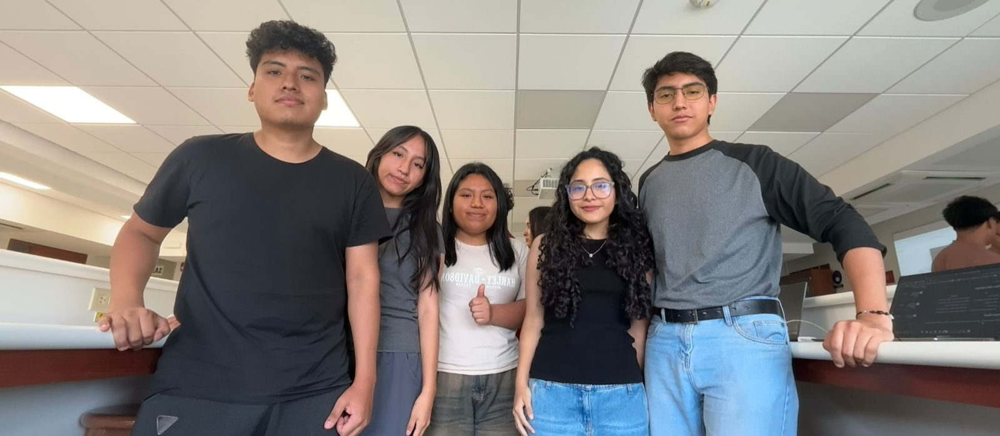
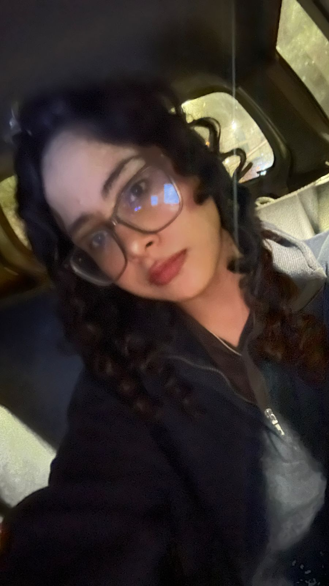

# FdD_Equipo_04

<strong> Carrera de Ingenieria Ambiental/ Informática / Industrial </strong>
 
Universidad Peruana Cayetano Heredia 

# 🌎 Descripción del grupo
Somos el equipo 04 del curso <strong> Fundamentos de diseño 2026-01 </strong>, ingenieria Informatica/Ambiental/Industrial. 
 
Nuestro objetivo es aplicar la metodología de diseño para generar soluciones innovadoras con impacto social, tecnológico y ambiental.
Nos interesa trabajar en los siguientes Objetivos de Desarrollo Sostenible (ODS):

ODS 7: Energia asequible y no contaminante
 
ODS 12: Producción y consumo responsable
 
ODS 13: Acción por el clima
 

#  📸 Fotografia del equipo 

  <em>
  Figura 1. Fotografia del Equipo 4

#  👥  Integrantes del equipo 

| Foto | Nombre | Rol | Intereses | 
| ---- | ------ | --- | --------- | 
|  | Saori | Programador | Programación, análisis de datos, prototipado | 
| ---- | Jesilin | Responsable de investigación | Analisis de problemáticas, Enfoque de soluciones responsables | 
| ---- | Matías | Lider del grupo | Innovación social, sostenibilidad | 
| ---- | Adriana | Diseñadora | Prototipo y maquetas | Creatividad estetica |
| ---- | Jose | Encargado/a de documentación | documentación científica, redacción técnica | 

# 📌Resumen final 
Este README resume quiénes somos, qué nos motiva y en qué ODS queremos enfocar nuestro trabajo durante el curso
