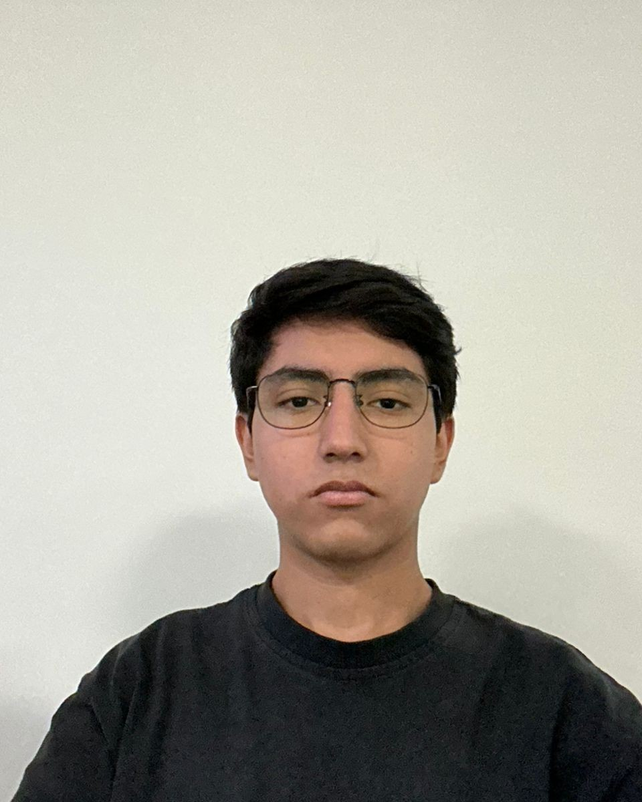
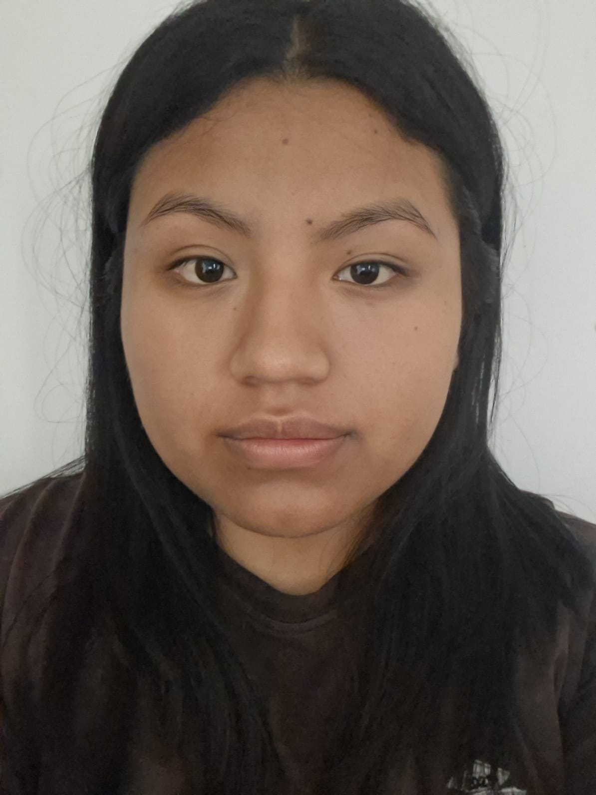
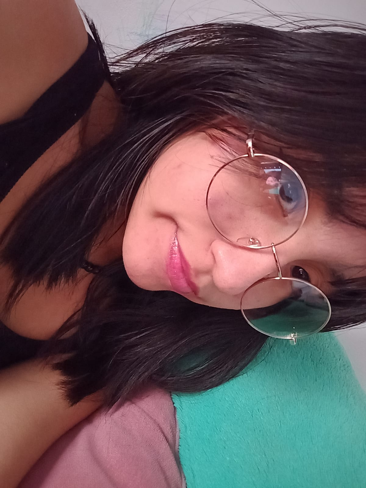
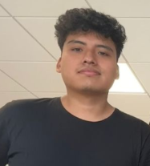

# FdD_Equipo_04

<strong> Carrera de Ingenieria Ambiental/ Informática / Industrial </strong>
 
Universidad Peruana Cayetano Heredia 

# 📚 Descripción del proyecto
La idea del proyecto es un aparato que tenga sensores de temperatura, humedad y radiación. Estos se comunican mediante el ESP32 a una aplicación móvil que da recomendaciones al usuario de tipo "recuerda aplicar bloqueador" o "no olvides tu abrigo".
 
 
<strong> Listas de exigencias que debemos cumplir: <strong>
 
1. Asumir el problema en forma crítica.
Estudiantes universitarios el Perú caminan mucho entre clases y paraderos bajo radiación UV extrema (índice 11+), humedad del 80% y temperaturas de 28-33°C, lo que causa quemaduras, deshidratación o golpes de calor; el problema es crítico porque no usan protección por falta de alertas inmediatas, agravado por el cambio climático que intensifica estos riesgos en la costa peruana.
2. Averiguar el estado de la tecnología.
El ESP32 ya integra WiFi/Bluetooth para apps móviles (como Blynk o MIT App Inventor), sensores como DHT22 (temperatura/humedad), SI1145 (UV/radiación); apps dan notificaciones push en tiempo real, con ejemplos como wearables UV (UVI Monitor) o estaciones meteorológicas portátiles, pero faltan soluciones integrales solares y locales para Perú.
3. Analizar la situación del problema.
En el Perú, la radiación alta por nubosidad engañosa (sensación térmica bochornosa), humedad costera y calor urbano afectan a 70% de jóvenes sin hábitos preventivos; ODS 13 aplica por adaptación climática, ODS 7 por recarga solar (reduce baterías desechables), ODS 12 por diseño modular.
4. Comprobar las posibilidades de realización.
Con respecto a los costos, esto es viable con ESP32 (costo $45), sensores ($20 c/u) y app gratuita; prototipo en 2 semanas con Arduino IDE; pruebas en Lima confirman precisión (DHT22 ±2%, SI1145 UVI ±10%); 
 

# 🌎 Descripción del grupo
Somos el equipo 04 del curso <strong> Fundamentos de diseño 2026-01 </strong>, ingenieria Informatica/Ambiental/Industrial. 
 
Nuestro objetivo es aplicar la metodología de diseño para generar soluciones innovadoras con impacto social, tecnológico y ambiental.
Nos interesa trabajar en los siguientes Objetivos de Desarrollo Sostenible (ODS):

ODS 7: Energia asequible y no contaminante.
 
Para que nuestra propuesta sea coherente, promueve el uso eficiente de la energía. Al medir temperatura, humedad y radiación, permite que los usuarios tomen decisiones como reducir el uso de aire acondicionado, calefacción o iluminación artificial, disminuyendo así el consumo energético.

 
ODS 12: Producción y consumo responsable.
 
 
Nuestra prioridad es prolongar la vida útil del equipo. En lugar de crear un producto desechable, nos inclinamos por un diseño reparable y reacondicionable. Esto significa que el aparato estará pensado para que sus piezas puedan ser revisadas o cambiadas fácilmente si se desgastan. Al evitar que el dispositivo se convierta en basura tecnológica prematura, fomentamos un consumo responsable donde la durabilidad es la característica principal, asegurando que la inversión de la comunidad rinda por mucho más tiempo.

 
 
ODS 13: Acción por el clima
 
 
Queremos enfocarnos en combatir los efectos del cambio climático que afectan la salud física. Estamos expuestos constantemente a niveles de humedad y radiación que han dejado de ser normales. Nuestra intención es ofrecer una herramienta de protección que ayude a las personas a adaptarse a estos riesgos. Al transformar los datos del clima en alertas directas, permitimos que la gente tome acciones inmediatas para evitar daños por la exposición prolongada, enfrentando así las consecuencias reales del calentamiento global en nuestro entorno local.
 

#  📸 Fotografia del equipo 

  <em>
  Figura 1. Fotografia del Equipo 4

#  👥  Integrantes del equipo 

| Foto | Nombre | Rol | Intereses | 
| ---- | ------ | --- | --------- | 
|  | Matías | Lider del grupo | Innovación social, sostenibilidad |
|  | Saori | Programador | Programación, análisis de datos, prototipado | 
| | Jesilin | Responsable de investigación | Analisis de problemáticas, Enfoque de soluciones responsables | 
|  | Adriana | Diseñadora | Prototipo y maquetas | Creatividad estetica |
|  | Jose | Encargado/a de documentación | documentación científica, redacción técnica | 

# 📌Resumen final 
Este README resume quiénes somos, qué nos motiva y en qué ODS queremos enfocar nuestro trabajo durante el curso
